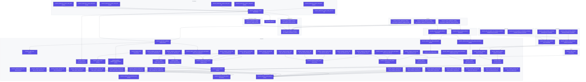

```mermaid
%%tfmermaid
%%{init:{"theme":"default","themeVariables":{"lineColor":"#6f7682","textColor":"#6f7682"}}}%%
flowchart TB
classDef r fill:#5c4ee5,stroke:#444,color:#fff
classDef v fill:#eeedfc,stroke:#eeedfc,color:#5c4ee5
classDef ms fill:none,stroke:#dce0e6,stroke-width:2px
classDef vs fill:none,stroke:#dce0e6,stroke-width:4px,stroke-dasharray:10
classDef ps fill:none,stroke:none
classDef cs fill:#f7f8fa,stroke:#dce0e6,stroke-width:2px
subgraph "n0"["Network"]
n1["azurerm_application_gateway.<br/>appgw-primary"]:::r
n2["azurerm_public_ip.ip-primary"]:::r
n3["azurerm_subnet.<br/>appgw-privatelink-subnet-primary"]:::r
n4["azurerm_subnet_network_security_group_association.<br/>subnet_nsg_appgw_pri"]:::r
n5["azurerm_bastion_host.<br/>host-primary"]:::r
n6["azurerm_public_ip.pip-primary"]:::r
n7["azurerm_subnet.<br/>bastion-subnet-primary"]:::r
n8["azurerm_subnet.<br/>aks-subnet-primary"]:::r
n9["azurerm_network_interface.<br/>linux-nic-primary"]:::r
na["azurerm_network_interface.<br/>windows-nic-primary"]:::r
nb["azurerm_subnet_network_security_group_association.<br/>primary"]:::r
nc["azurerm_subnet_route_table_association.<br/>primary"]:::r
nd["azurerm_network_ddos_protection_plan.<br/>primary"]:::r
ne["azurerm_subnet.<br/>vm-subnet-primary"]:::r
nf["azurerm_network_security_group.<br/>aks-primary"]:::r
ng["azurerm_network_security_group.<br/>appgw-primary"]:::r
nh["azurerm_network_security_group.<br/>primary"]:::r
ni["azurerm_network_security_group.<br/>redis-primary"]:::r
nj["azurerm_network_security_group.<br/>vm-primary"]:::r
nk["azurerm_network_security_rule.<br/>ag_nsg_rule_inbound2_pri"]:::r
nl["azurerm_network_security_rule.<br/>ag_nsg_rule_inbound_pri"]:::r
nm["azurerm_network_security_rule.<br/>allow-all-aks-pri"]:::r
nn["azurerm_network_security_rule.<br/>allow_geodr_inbound_pri"]:::r
no["azurerm_network_security_rule.<br/>allow_geodr_outbound_pri"]:::r
np["azurerm_network_security_rule.<br/>allow_health_probe_inbound_pri"]:::r
nq["azurerm_network_security_rule.<br/>allow_management_inbound_pri"]:::r
nr["azurerm_network_security_rule.<br/>allow_management_outbound_pri"]:::r
ns["azurerm_network_security_rule.<br/>allow_misubnet_inbound_pri"]:::r
nt["azurerm_network_security_rule.<br/>allow_misubnet_outbound_pri"]:::r
nu["azurerm_network_security_rule.<br/>allow_redirect_inbound_pri"]:::r
nv["azurerm_network_security_rule.<br/>allow_redirect_outbound_pri"]:::r
nw["azurerm_network_security_rule.<br/>allow_tds_inbound_pri"]:::r
nx["azurerm_network_security_rule.<br/>deny_all_aks_inbound_pri"]:::r
ny["azurerm_network_security_rule.<br/>deny_all_inbound_pri"]:::r
nz["azurerm_network_security_rule.<br/>deny_all_inbound_redis_pri"]:::r
n10["azurerm_network_security_rule.<br/>deny_all_inbound_vm_pri"]:::r
n11["azurerm_network_security_rule.<br/>deny_all_mssql_inbound_pri"]:::r
n12["azurerm_network_security_rule.<br/>deny_all_outbound_pri"]:::r
n13["azurerm_network_security_rule.<br/>nlb_all_inbound_pri"]:::r
n14["azurerm_network_security_rule.<br/>nlb_rule_inbound_pri"]:::r
n15["azurerm_network_security_rule.<br/>nlb_rule_inbound_redis_pri"]:::r
n16["azurerm_network_security_rule.<br/>nlb_rule_inbound_vm_pri"]:::r
n17["azurerm_network_security_rule.<br/>rule_inbound_pri"]:::r
n18["azurerm_network_security_rule.<br/>rule_inbound_redis_pri"]:::r
n19["azurerm_network_security_rule.<br/>rule_inbound_vm_pri"]:::r
n1a["azurerm_subnet.<br/>redis-subnet-primary"]:::r
n1b["azurerm_route_table.primary"]:::r
n1c["azurerm_subnet.<br/>sqlmi-subnet-primary"]:::r
n1d["azurerm_virtual_network.<br/>primary"]:::r
n1e["azurerm_subnet.<br/>appgw-subnet-primary"]:::r
n1f["azurerm_subnet_network_security_group_association.<br/>subnet_nsg_redis_pri"]:::r
n1g["azurerm_subnet_network_security_group_association.<br/>subnet_nsg_vm_pri"]:::r
end
class n0 cs
subgraph "n1h"["Application Insights"]
n1i["azurerm_application_insights.<br/>application_insights_primary"]:::r
end
class n1h cs
subgraph "n1j"["Log Analytics"]
n1k["azurerm_log_analytics_workspace.<br/>log_analytics_workspace_primary"]:::r
n1l["azurerm_log_analytics_solution.<br/>log_analytics_solution_primary"]:::r
end
class n1j cs
subgraph "n1m"["Dev Test"]
n1n["azurerm_dev_test_global_vm_shutdown_schedule.<br/>schedule-linux-vm-primary"]:::r
n1o["azurerm_dev_test_global_vm_shutdown_schedule.<br/>schedule-windows-vm-primary"]:::r
end
class n1m cs
subgraph "n1p"["Compute"]
n1q["azurerm_linux_virtual_machine.<br/>linux-vm-primary"]:::r
n1r["azurerm_windows_virtual_machine.<br/>windows-vm-primary"]:::r
n1s["azurerm_virtual_machine_extension.<br/>bootstrap-linux-vm-primary"]:::r
n1t["azurerm_virtual_machine_extension.<br/>bootstrap-windows-vm-primary"]:::r
end
class n1p cs
subgraph "n1u"["Container"]
n1v["azurerm_kubernetes_cluster.<br/>aks-primary"]:::r
n1w["azurerm_kubernetes_cluster_node_pool.ccm<br/>[0]"]:::r
n1x["azurerm_kubernetes_cluster_node_pool.<br/>gateway"]:::r
n1y["azurerm_kubernetes_cluster_node_pool.<br/>hq-app"]:::r
n1z["azurerm_kubernetes_cluster_node_pool.<br/>hq-dms"]:::r
n20["azurerm_kubernetes_cluster_node_pool.<br/>mf"]:::r
n21["azurerm_kubernetes_cluster_node_pool.<br/>rabbithq"]:::r
n22["azurerm_kubernetes_cluster_node_pool.<br/>rabbitmf"]:::r
end
class n1u cs
n23["tls_private_key.ssh"]:::r
subgraph "n24"["Monitor"]
n25["azurerm_monitor_diagnostic_setting.<br/>log_analytics_diagnostic_appgw_primary"]:::r
n26["azurerm_monitor_diagnostic_setting.<br/>log_analytics_diagnostic_mssql_hq_primary"]:::r
n27["azurerm_monitor_diagnostic_setting.<br/>log_analytics_diagnostic_mssql_mf_primary"]:::r
end
class n24 cs
subgraph "n28"["Database"]
n29["azurerm_mssql_managed_instance.<br/>hq-primary"]:::r
n2a["azurerm_mssql_managed_instance.<br/>mf-primary"]:::r
end
class n28 cs
subgraph "n2b"["Redis"]
n2c["azurerm_redis_cache.<br/>redis-primary"]:::r
end
class n2b cs
n1-->n2
n1-->n3
n1-->n4
n1i-->n1k
n5-->n6
n5-->n7
n1n-->n1q
n1o-->n1r
n1v-->n1
n1v-->n1l
n1v-->n8
n1v-->n23
n1x-->n1v
n1y-->n1v
n1z-->n1v
n20-->n1v
n21-->n1v
n22-->n1v
n1q-->n9
n1q-->na
n1l-->n1k
n25-->n1
n25-->n1k
n26-->n1k
n26-->n29
n27-->n1k
n27-->n2a
n29-->nb
n29-->nc
n2a-->nb
n2a-->nc
n9-->ne
na-->ne
nk-->ng
nl-->ng
nm-->nf
nn-->nh
no-->nh
np-->nh
nq-->nh
nr-->nh
ns-->nh
nt-->nh
nu-->nh
nv-->nh
nw-->nh
nx-->nf
ny-->ng
nz-->ni
n10-->nj
n11-->nh
n12-->nh
n13-->nf
n14-->ng
n15-->ni
n16-->nj
n17-->ng
n18-->ni
n19-->nj
n2c-->n1a
n1b-->n1c
n8-->n1d
n3-->n1d
n1e-->n1d
n7-->n1d
n1a-->n1d
n1c-->n1d
ne-->n1d
nb-->n1c
n4-->ng
n4-->n1e
n1f-->ni
n1f-->n1a
n1g-->nj
n1g-->ne
nc-->n1b
n1s-->n1q
n1t-->n1r
n1d-->nd
n1d-->nh
n1r-->na
```
