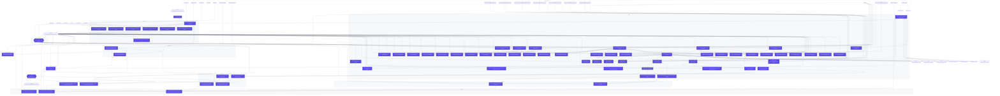

```mermaid
%%tfmermaid
%%{init:{"theme":"default","themeVariables":{"lineColor":"#6f7682","textColor":"#6f7682"}}}%%
flowchart TB
classDef r fill:#5c4ee5,stroke:#444,color:#fff
classDef v fill:#eeedfc,stroke:#eeedfc,color:#5c4ee5
classDef ms fill:none,stroke:#dce0e6,stroke-width:2px
classDef vs fill:none,stroke:#dce0e6,stroke-width:4px,stroke-dasharray:10
classDef ps fill:none,stroke:none
classDef cs fill:#f7f8fa,stroke:#dce0e6,stroke-width:2px
subgraph "n0"["Network"]
n1["azurerm_application_gateway.<br/>appgw-primary"]:::r
n2["azurerm_bastion_host.<br/>host-primary"]:::r
n3["azurerm_network_ddos_protection_plan.<br/>primary"]:::r
n4["azurerm_network_interface.<br/>linux-nic-primary"]:::r
n5["azurerm_network_interface.<br/>windows-nic-primary"]:::r
n6["azurerm_network_security_group.<br/>aks-primary"]:::r
n7["azurerm_network_security_group.<br/>appgw-primary"]:::r
n8["azurerm_network_security_group.<br/>primary"]:::r
n9["azurerm_network_security_group.<br/>redis-primary"]:::r
na["azurerm_network_security_group.<br/>vm-primary"]:::r
nb["azurerm_network_security_rule.<br/>ag_nsg_rule_inbound2_pri"]:::r
nc["azurerm_network_security_rule.<br/>ag_nsg_rule_inbound_pri"]:::r
nd["azurerm_network_security_rule.<br/>allow-all-aks-pri"]:::r
ne["azurerm_network_security_rule.<br/>allow_geodr_inbound_pri"]:::r
nf["azurerm_network_security_rule.<br/>allow_geodr_outbound_pri"]:::r
ng["azurerm_network_security_rule.<br/>allow_health_probe_inbound_pri"]:::r
nh["azurerm_network_security_rule.<br/>allow_management_inbound_pri"]:::r
ni["azurerm_network_security_rule.<br/>allow_management_outbound_pri"]:::r
nj["azurerm_network_security_rule.<br/>allow_misubnet_inbound_pri"]:::r
nk["azurerm_network_security_rule.<br/>allow_misubnet_outbound_pri"]:::r
nl["azurerm_network_security_rule.<br/>allow_redirect_inbound_pri"]:::r
nm["azurerm_network_security_rule.<br/>allow_redirect_outbound_pri"]:::r
nn["azurerm_network_security_rule.<br/>allow_tds_inbound_pri"]:::r
no["azurerm_network_security_rule.<br/>deny_all_aks_inbound_pri"]:::r
np["azurerm_network_security_rule.<br/>deny_all_inbound_pri"]:::r
nq["azurerm_network_security_rule.<br/>deny_all_inbound_redis_pri"]:::r
nr["azurerm_network_security_rule.<br/>deny_all_inbound_vm_pri"]:::r
ns["azurerm_network_security_rule.<br/>deny_all_mssql_inbound_pri"]:::r
nt["azurerm_network_security_rule.<br/>deny_all_outbound_pri"]:::r
nu["azurerm_network_security_rule.<br/>nlb_all_inbound_pri"]:::r
nv["azurerm_network_security_rule.<br/>nlb_rule_inbound_pri"]:::r
nw["azurerm_network_security_rule.<br/>nlb_rule_inbound_redis_pri"]:::r
nx["azurerm_network_security_rule.<br/>nlb_rule_inbound_vm_pri"]:::r
ny["azurerm_network_security_rule.<br/>rule_inbound_pri"]:::r
nz["azurerm_network_security_rule.<br/>rule_inbound_redis_pri"]:::r
n10["azurerm_network_security_rule.<br/>rule_inbound_vm_pri"]:::r
n11["azurerm_public_ip.ip-primary"]:::r
n12["azurerm_public_ip.pip-primary"]:::r
n13["azurerm_route_table.primary"]:::r
n14["azurerm_subnet.<br/>aks-subnet-primary"]:::r
n15["azurerm_subnet.<br/>appgw-privatelink-subnet-primary"]:::r
n16["azurerm_subnet.<br/>appgw-subnet-primary"]:::r
n17["azurerm_subnet.<br/>bastion-subnet-primary"]:::r
n18["azurerm_subnet.<br/>redis-subnet-primary"]:::r
n19["azurerm_subnet.<br/>sqlmi-subnet-primary"]:::r
n1a["azurerm_subnet.<br/>vm-subnet-primary"]:::r
n1b["azurerm_subnet_network_security_group_association.<br/>primary"]:::r
n1c["azurerm_subnet_network_security_group_association.<br/>subnet_nsg_appgw_pri"]:::r
n1d["azurerm_subnet_network_security_group_association.<br/>subnet_nsg_redis_pri"]:::r
n1e["azurerm_subnet_network_security_group_association.<br/>subnet_nsg_vm_pri"]:::r
n1f["azurerm_subnet_route_table_association.<br/>primary"]:::r
n1g["azurerm_virtual_network.<br/>primary"]:::r
end
class n0 cs
subgraph "n1h"["Application Insights"]
n1i["azurerm_application_insights.<br/>application_insights_primary"]:::r
end
class n1h cs
subgraph "n1j"["Dev Test"]
n1k["azurerm_dev_test_global_vm_shutdown_schedule.<br/>schedule-linux-vm-primary"]:::r
n1l["azurerm_dev_test_global_vm_shutdown_schedule.<br/>schedule-windows-vm-primary"]:::r
end
class n1j cs
subgraph "n1m"["Container"]
n1n["azurerm_kubernetes_cluster.<br/>aks-primary"]:::r
n1o["azurerm_kubernetes_cluster_node_pool.ccm<br/>[0]"]:::r
n1p["azurerm_kubernetes_cluster_node_pool.<br/>gateway"]:::r
n1q["azurerm_kubernetes_cluster_node_pool.<br/>hq-app"]:::r
n1r["azurerm_kubernetes_cluster_node_pool.<br/>hq-dms"]:::r
n1s["azurerm_kubernetes_cluster_node_pool.<br/>mf"]:::r
n1t["azurerm_kubernetes_cluster_node_pool.<br/>rabbithq"]:::r
n1u["azurerm_kubernetes_cluster_node_pool.<br/>rabbitmf"]:::r
end
class n1m cs
subgraph "n1v"["Compute"]
n1w["azurerm_linux_virtual_machine.<br/>linux-vm-primary"]:::r
n1x["azurerm_virtual_machine_extension.<br/>bootstrap-linux-vm-primary"]:::r
n1y["azurerm_virtual_machine_extension.<br/>bootstrap-windows-vm-primary"]:::r
n1z["azurerm_windows_virtual_machine.<br/>windows-vm-primary"]:::r
end
class n1v cs
subgraph "n20"["Log Analytics"]
n21["azurerm_log_analytics_solution.<br/>log_analytics_solution_primary"]:::r
n22["azurerm_log_analytics_workspace.<br/>log_analytics_workspace_primary"]:::r
end
class n20 cs
subgraph "n23"["Monitor"]
n24["azurerm_monitor_diagnostic_setting.<br/>log_analytics_diagnostic_appgw_primary"]:::r
n25["azurerm_monitor_diagnostic_setting.<br/>log_analytics_diagnostic_mssql_hq_primary"]:::r
n26["azurerm_monitor_diagnostic_setting.<br/>log_analytics_diagnostic_mssql_mf_primary"]:::r
end
class n23 cs
subgraph "n27"["Database"]
n28["azurerm_mssql_managed_instance.<br/>hq-primary"]:::r
n29["azurerm_mssql_managed_instance.<br/>mf-primary"]:::r
end
class n27 cs
subgraph "n2a"["Redis"]
n2b["azurerm_redis_cache.<br/>redis-primary"]:::r
end
class n2a cs
subgraph "n2c"["Base"]
n2d{{"data.<br/>azurerm_resource_group.<br/>primary"}}:::r
end
class n2c cs
n2e{{"data.<br/>template_file.<br/>file-windows-vm-primary"}}:::r
n2f[/"provider<br/>[&quot;registry.terraform.io/hashicorp/azurerm&quot;]"\]
n2g[/"provider<br/>[&quot;registry.terraform.io/hashicorp/template&quot;]"\]
n2h[/"provider<br/>[&quot;registry.terraform.io/hashicorp/tls&quot;]"\]
n2i["tls_private_key.ssh"]:::r
subgraph "n2j"["Input Variables"]
n2k(["var.client_id"]):::v
n2l(["var.client_secret"]):::v
n2m(["var.customer"]):::v
n2n(["var.location"]):::v
n2o(["var.prefix"]):::v
n2p(["var.sql_hq_password"]):::v
n2q(["var.sql_mf_password"]):::v
n2r(["var.<br/>subnet_address_prefix_aks_primary"]):::v
n2s(["var.<br/>subnet_address_prefix_appgw_primary"]):::v
n2t(["var.<br/>subnet_address_prefix_appgw_privatelink_primary"]):::v
n2u(["var.<br/>subnet_address_prefix_bastion_primary"]):::v
n2v(["var.<br/>subnet_address_prefix_mmsql_primary"]):::v
n2w(["var.<br/>subnet_address_prefix_redis_primary"]):::v
n2x(["var.<br/>subnet_address_prefix_vm_primary"]):::v
n2y(["var.tags"]):::v
n2z(["var.<br/>virtual_network_address_prefix_primary"]):::v
n30(["var.waf_configuration"]):::v
n31(["var.waf_enabled"]):::v
end
class n2j vs
n32(["local.<br/>backend_address_pool_name"]):::v
n33(["local.<br/>frontend_ip_configuration_name"]):::v
n34(["local.frontend_port_name"]):::v
n35(["local.http_setting_name"]):::v
n36(["local.listener_name"]):::v
n37(["local.<br/>request_routing_rule_name"]):::v
n38(["local.sku_name"]):::v
n39(["local.sku_tier"]):::v
n3a(["local.gateway"]):::v
n3b(["local.hq-app"]):::v
n3c(["local.hq-dms"]):::v
n3d(["local.mf"]):::v
n3e(["local.rabbithq"]):::v
n3f(["local.rabbitmf"]):::v
n3g(["local.<br/>redirect_configuration_name"]):::v
n11-->n1
n15-->n1
n1c-->n1
n32-->n1
n33-->n1
n34-->n1
n35-->n1
n36-->n1
n37-->n1
n38-->n1
n39-->n1
n30--->n1
n22-->n1i
n12-->n2
n17-->n2
n1w-->n1k
n1z-->n1l
n1-->n1n
n21-->n1n
n14-->n1n
n2i-->n1n
n2k--->n1n
n2l--->n1n
n2f-->n1o
n1n-->n1p
n3a-->n1p
n1n-->n1q
n3b-->n1q
n1n-->n1r
n3c-->n1r
n1n-->n1s
n3d-->n1s
n1n-->n1t
n3e-->n1t
n1n-->n1u
n3f-->n1u
n4-->n1w
n5-->n1w
n22-->n21
n2d-->n22
n2y--->n22
n1-->n24
n22-->n24
n22-->n25
n28-->n25
n22-->n26
n29-->n26
n1b-->n28
n1f-->n28
n2p--->n28
n1b-->n29
n1f-->n29
n2q--->n29
n2d-->n3
n2y--->n3
n1a-->n4
n1a-->n5
n2d-->n6
n2y--->n6
n2d-->n7
n2y--->n7
n2d-->n8
n2y--->n8
n2d-->n9
n2y--->n9
n2d-->na
n2y--->na
n7-->nb
n7-->nc
n6-->nd
n8-->ne
n8-->nf
n8-->ng
n8-->nh
n8-->ni
n8-->nj
n2v--->nj
n8-->nk
n2v--->nk
n8-->nl
n8-->nm
n8-->nn
n6-->no
n7-->np
n9-->nq
na-->nr
n8-->ns
n8-->nt
n6-->nu
n7-->nv
n9-->nw
na-->nx
n7-->ny
n9-->nz
na-->n10
n2d-->n11
n2y--->n11
n2d-->n12
n18-->n2b
n19-->n13
n1g-->n14
n2r--->n14
n1g-->n15
n2t--->n15
n1g-->n16
n2s--->n16
n1g-->n17
n2u--->n17
n1g-->n18
n2w--->n18
n1g-->n19
n2v--->n19
n1g-->n1a
n2x--->n1a
n19-->n1b
n7-->n1c
n16-->n1c
n9-->n1d
n18-->n1d
na-->n1e
n1a-->n1e
n13-->n1f
n1w-->n1x
n1z-->n1y
n2e-->n1y
n3-->n1g
n8-->n1g
n2z--->n1g
n5-->n1z
n2f-->n2d
n2m--->n2d
n2o--->n2d
n2g-->n2e
n1g-->n32
n1g-->n33
n1g-->n34
n1g-->n35
n1g-->n36
n1g-->n3g
n1g-->n37
n31--->n38
n31--->n39
n1i-->n2f
n2-->n2f
n1k-->n2f
n1l-->n2f
n1o-->n2f
n1p-->n2f
n1q-->n2f
n1r-->n2f
n1s-->n2f
n1t-->n2f
n1u-->n2f
n24-->n2f
n25-->n2f
n26-->n2f
nb-->n2f
nc-->n2f
nd-->n2f
ne-->n2f
nf-->n2f
ng-->n2f
nh-->n2f
ni-->n2f
nj-->n2f
nk-->n2f
nl-->n2f
nm-->n2f
nn-->n2f
no-->n2f
np-->n2f
nq-->n2f
nr-->n2f
ns-->n2f
nt-->n2f
nu-->n2f
nv-->n2f
nw-->n2f
nx-->n2f
ny-->n2f
nz-->n2f
n10-->n2f
n2b-->n2f
n1d-->n2f
n1e-->n2f
n1x-->n2f
n1y-->n2f
n2e-->n2g
n2i-->n2h
n2h-->n2i
```
